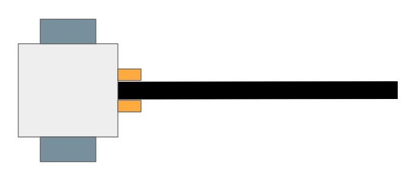
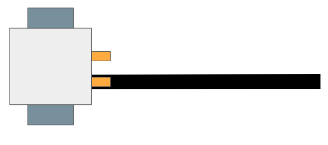
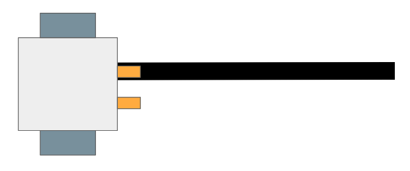
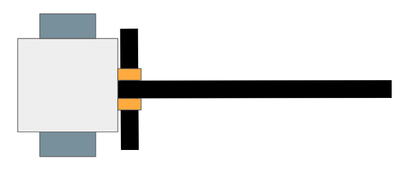
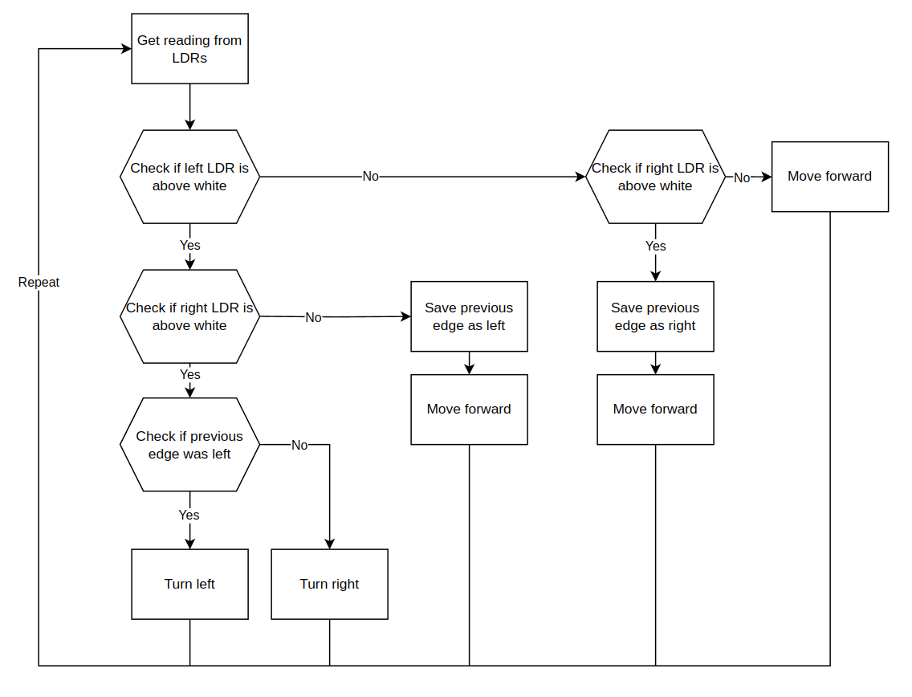

# Design

There are many ways to design a line following robot, but we will only be discussing one of them. 

Assumptions made: 
- only 2 sensors are being used to detect the presence of the black line 
- the distance between the 2 sensors are fixed and can't be changed during operation 
- the robot has 2 motor-powered wheels

For our implementation, the 2 sensors we have chosen are Light Dependent Resistors (LDRs). By shining a light on the ground using an array of Light Emitting Diodes (LEDs), the resistance of the LDRs, when pointed towards the floor, vary with the light level reflected back to it. The black strip will reflect less light compared to the white floor, allowing us to differentiate between the two. 

The method we have chosen involves 3 different scenarios: 
- robot is on the center of the line 
- robot is on the left edge of the line 
- robot is on the right edge of the line 
- robot is at a checkpoint

> We will refer to any straight black line perpendicular to the path as a **checkpoint**

## Truth table

Based on these scenarios, we can create a psuedo-truth table to determine the different states the robot. 

| leftLDR | rightLDR | robotState |
|---------|----------|-------|
| white | white | center of line |
| white | black | left of line  |
| black | white | right of line |
| black | black | at checkpoint |

To help with visualising the different robot states, refer to the diagrams below: 

> Center 

> Left 

> Right

> Checkpoint

## Method

From the above truth table, we can determine a possible method to approach this problem. 

1. When the robot is on the left edge, keep following it 
2. When the robot is on the right edge, keep following it 
3. When the robot is at a checkpoint, skip it by moving forward 
4. When the robot is in the center of the line, move towards the previous edge it was following

> Try to think of other ways you could do this! The method being used here is a modification of the single sensor *edge following* method. 

## Flow chart 

We can represent our method in terms of a flow chart. This is the closest representation we can have to the actual code without writing any. 

