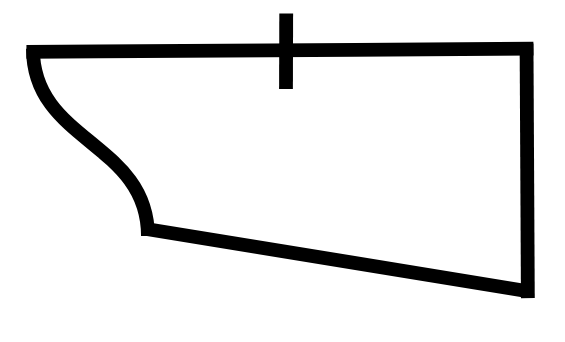

# Line Following

Building a line following robot is a great way to practice your Arduino skills! 

In essence, the robot follows a black line on a white map. The black line can make curves, sharp bends, and even have "road blocks" around them.

Example of a map for a line following robot:

This example will bring you through the various parts of a line following robot, as well as the methods you could use to approach the problem. 
